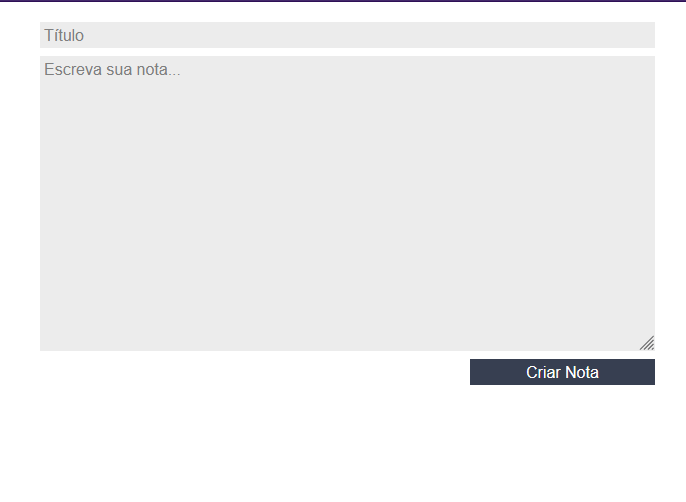
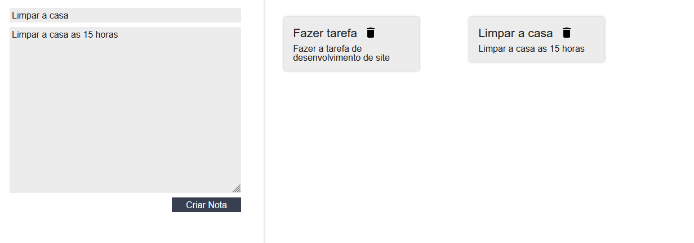

# Sistema de Gerenciamento de notas em React

Desenvolvimento de um sistema de cadastro de notas/lembretes com React. Esse exemplo foi desenvolvido utilizando as aulas da Alura para entender melhor os componentes do React.

    Conteúdo aprendido:
        Componentes
        Renderização 
        Estilização
    
---
    Para rodar o projeto, basta baixar e dar os seguintes comandos:

* `npm i` Para baixar as dependências do Package.Json 
* `npm start` para rodar o projeto

-----------------------------------

